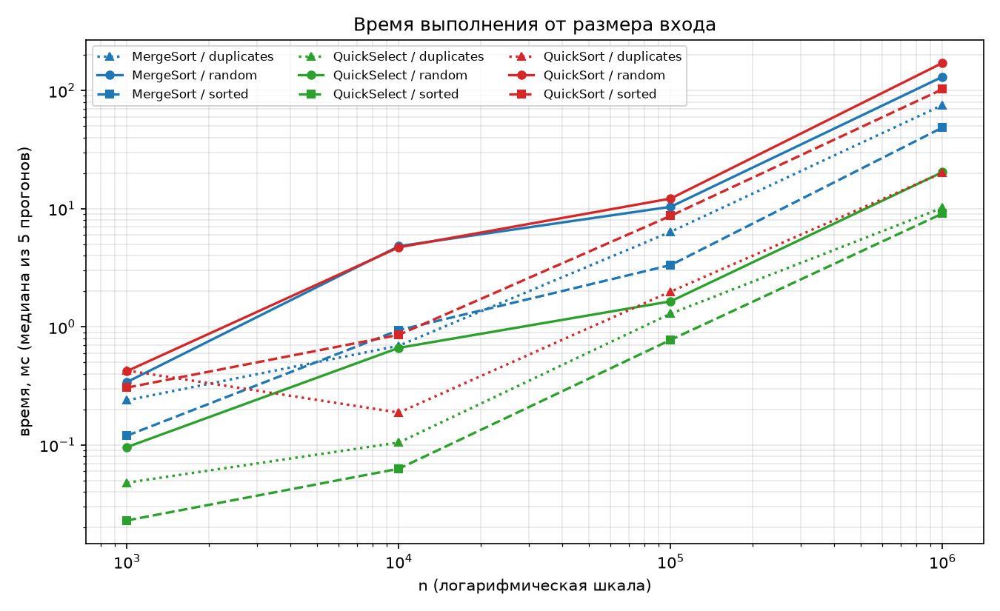
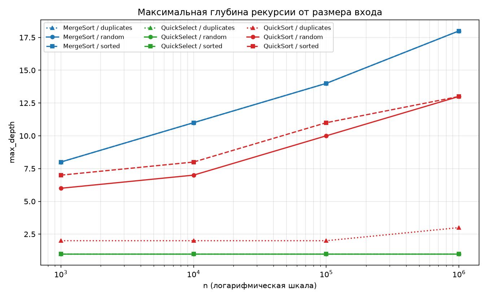
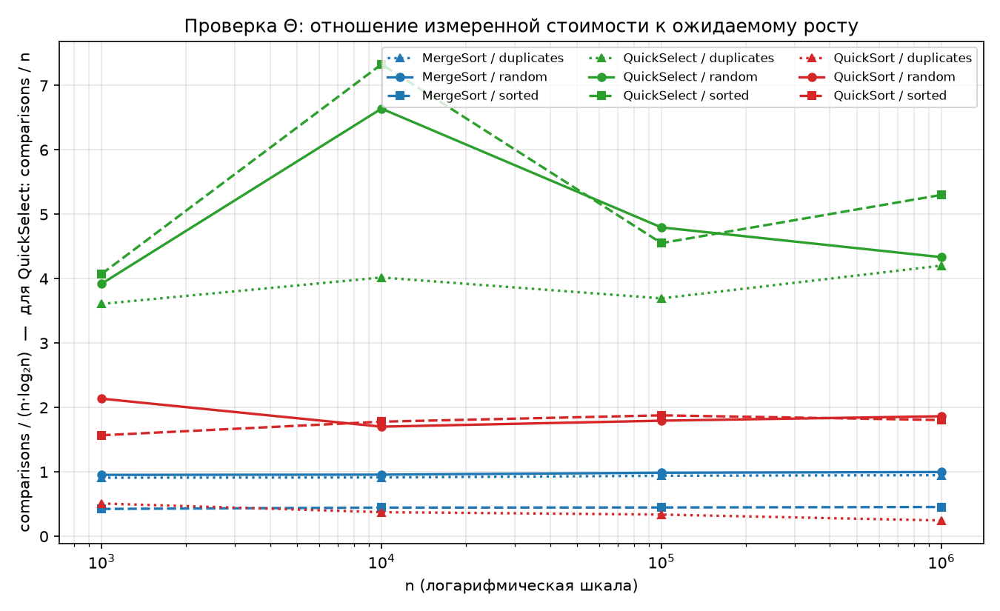

# Report — Assignment 1: Divide and Conquer & Asymptotic Notations

Author: Adilzhan Kuandykov
Repository: https://github.com/adilzhandev/assignment1-DAA

---

## 1. Asymptotic Bounds

| Algorithm | Best | Average | Worst | Reason (which input gives this case) |
|---|---|---|---|---|
| MergeSort | Θ(n log n) | Θ(n log n) | Θ(n log n) | The array is always split exactly in half, so the shape of the input cannot change the number of levels. Only the merge step reacts to the data: on sorted input one half is exhausted early and the ratio drops to 0.46, but the growth stays the same. |
| QuickSort | Ω(n log n) | Θ(n log n) | O(n²) | Best and average: a random pivot splits the array into two comparable parts. Worst: every pivot is the minimum or the maximum, so one side is empty. With a random pivot and a 3-way partition this input cannot be constructed in advance, which is why the bound is written as O and not Θ. |
| QuickSelect | Ω(n) | Θ(n) | O(n²) | Average: each partition throws away a constant fraction, so the total work is n + n/2 + n/4 + ... = 2n. Worst: repeated extremely unbalanced pivots, which a random pivot makes very unlikely. |
| Insertion Sort | Θ(n) | Θ(n²) | Θ(n²) | Best: the array is already sorted, so the inner loop breaks after one comparison. Worst: the array is in reverse order, so every element is shifted through the whole prefix. |

---

## 2. Recurrences and Master Theorem

### MergeSort

T(n) = 2·T(n/2) + Θ(n)

MergeSort splits the array into two halves and merges them in linear time, so
a = 2, b = 2 and f(n) = Θ(n). The comparison value is n^(log_b a) = n^(log2 2) = n.
Since f(n) = Θ(n) grows at the same rate as n, this is **case 2** of the Master
Theorem, and the result is **Θ(n log n)**.

The measurements agree: the ratio `comparisons / (n·log2 n)` stays between 0.95
and 1.00 on random input across all four sizes, so the measured cost really does
follow n·log2 n.

### QuickSort (assuming a balanced split)

T(n) = 2·T(n/2) + Θ(n)

With a balanced split the recurrence is the same as for MergeSort: a = 2, b = 2
and f(n) = Θ(n), because the partition step scans the whole subarray once. Again
n^(log2 2) = n matches f(n), so this is **case 2** and the result is **Θ(n log n)**.

A random pivot gives O(n log n) on average because the pivot splits the array in a
random proportion, and even a poor split still removes a constant fraction of the
elements. A 1:9 split, for example, gives a depth of log(1/0.9)(n), which is only a
constant factor larger than log2 n. To reach the quadratic worst case, bad splits
would have to repeat many times in a row, and the probability of that falls
exponentially. The expected number of comparisons is about 2n·ln n ≈ 1.39·n·log2 n;
our measured ratio on random input is 1.70–2.14, slightly higher because the 3-way
partition performs up to two comparisons per element instead of one.

### QuickSelect (assuming a balanced split)

T(n) = 1·T(n/2) + Θ(n)

This is a different Master Theorem case, because QuickSelect solves only **one**
subproblem instead of two: after the partition it continues in the part that
contains position k and discards the other part completely. So a = 1, b = 2 and
f(n) = Θ(n). Here n^(log_b a) = n^(log2 1) = n^0 = 1, and f(n) = Θ(n) grows strictly
faster than that. This is **case 3** of the Master Theorem, and the result is
**Θ(n)**: the cost is dominated by the very first level.

Intuitively, the work forms a geometric series n + n/2 + n/4 + ... = 2n, which
converges to a linear total. The measurements confirm this: `comparisons / n` stays
between 3.6 and 7.3 with no upward trend as n grows by a factor of 1000.

---

## 3. Measurements

Setup: JDK 17, median of 5 runs for every case.
Full data is in `results.csv`.

### Time, ms

| n | MS random | MS sorted | MS dup | QS random | QS sorted | QS dup | Sel random | Sel sorted | Sel dup |
|---|---|---|---|---|---|---|---|---|---|
| 1 000 | 0.397 | 0.132 | 0.208 | 0.404 | 0.323 | 0.463 | 0.082 | 0.017 | 0.082 |
| 10 000 | 5.072 | 0.320 | 0.666 | 5.409 | 2.439 | 0.200 | 0.762 | 0.103 | 0.156 |
| 100 000 | 11.045 | 3.194 | 6.391 | 12.336 | 8.720 | 1.954 | 1.554 | 0.589 | 1.251 |
| 1 000 000 | 128.661 | 44.354 | 77.186 | 152.365 | 100.945 | 19.657 | 16.478 | 7.385 | 13.333 |

### Maximum recursion depth

| n | MS random | MS sorted | MS dup | QS random | QS sorted | QS dup | Sel random | Sel sorted | Sel dup |
|---|---|---|---|---|---|---|---|---|---|
| 1 000 | 8 | 8 | 8 | 5 | 6 | 2 | 11 | 12 | 4 |
| 10 000 | 11 | 11 | 11 | 8 | 8 | 3 | 19 | 18 | 5 |
| 100 000 | 14 | 14 | 14 | 11 | 11 | 2 | 15 | 25 | 3 |
| 1 000 000 | 18 | 18 | 18 | 13 | 13 | 3 | 24 | 21 | 5 |

The limit from the task, `2·log2(n)`, is 19 / 26 / 33 / 39 for the four sizes.
For QuickSelect this column counts loop iterations, not stack depth: the algorithm
is iterative and always uses a single stack frame.

### Ratio (Θ check)

For the sorts: `comparisons / (n·log2 n)`. For QuickSelect: `comparisons / n`.

| n | MS random | MS sorted | MS dup | QS random | QS sorted | QS dup | Sel random | Sel sorted | Sel dup |
|---|---|---|---|---|---|---|---|---|---|
| 1 000 | 0.95 | 0.43 | 0.91 | 2.14 | 1.57 | 0.51 | 3.92 | 4.07 | 3.61 |
| 10 000 | 0.96 | 0.45 | 0.91 | 1.70 | 1.78 | 0.38 | 6.64 | 7.33 | 4.02 |
| 100 000 | 0.99 | 0.45 | 0.94 | 1.80 | 1.88 | 0.34 | 4.80 | 4.55 | 3.69 |
| 1 000 000 | 1.00 | 0.46 | 0.95 | 1.86 | 1.81 | 0.25 | 4.33 | 5.30 | 4.20 |

---

## 4. Plots

---

## 5. Θ Check

Bounds of the ratio for every series (over the four sizes):

| series | c1 (min) | c2 (max) |
|---|---|---|
| MergeSort / random | 0.95 | 1.00 |
| MergeSort / sorted | 0.43 | 0.46 |
| MergeSort / duplicates | 0.91 | 0.95 |
| QuickSort / random | 1.70 | 2.14 |
| QuickSort / sorted | 1.57 | 1.88 |
| QuickSort / duplicates | 0.25 | 0.51 |
| QuickSelect / random | 3.92 | 6.64 |
| QuickSelect / sorted | 4.07 | 7.33 |
| QuickSelect / duplicates | 3.61 | 4.20 |

By the definition of Θ we need constants c1, c2 and n0 such that
c1·g(n) ≤ f(n) ≤ c2·g(n) for all n ≥ n0, where f(n) is the measured number of
comparisons and g(n) is n·log2 n for the sorts and n for QuickSelect.

For MergeSort the ratio is almost perfectly constant from the smallest size we
measured, so n0 = 1000 with c1 = 0.95 and c2 = 1.00 on random input. The series is
so flat that the bound is clearly tight, which confirms Θ(n log n) rather than just
O(n log n). The sorted and duplicate series are equally flat but sit at a different
level (around 0.45 and 0.93), which shows that the input shape changes the constant
factor and not the growth rate.

For QuickSort the ratio is stable from n = 10 000 onwards, so n0 = 10 000 with
c1 = 1.70 and c2 = 1.88 on random input. The value at n = 1000 (2.14) is slightly
outside this band, which is expected: at small sizes a single unlucky pivot has a
visible effect on the average.

For QuickSelect the ratio stays inside 3.6–7.3 and does not grow with n, so the
linear bound holds with n0 = 1000, c1 = 3.6 and c2 = 7.3. The spread is clearly
wider than for the sorts, and this is not noise in the measurement: each QuickSelect
run performs only about log n partitions, so a single unlucky pivot changes the total
number of comparisons noticeably. MergeSort, by contrast, performs the same
deterministic amount of work every time, and QuickSort averages its randomness over
many more partition calls. A larger number of repetitions would narrow the
QuickSelect band, but the important observation is that it is bounded and does not
drift upwards.

---

## 6. Discussion (5–10 sentences)

The measured comparison counts match the theory closely, but the measured times do
not always follow them, and the reasons are all outside the asymptotic model.

The clearest example is memory behaviour. In an early version of MergeSort the
auxiliary array was allocated inside every merge call. At n = 100 000 that version
needed 5000.51 ms, while the final version with a single reusable buffer needed
12.66 ms — with exactly the same 1 536 159 comparisons. The algorithm did not change
at all; the difference is entirely allocation pressure and garbage collection, which
the Θ notation does not describe.

The second effect is JVM warm-up. Running the same sort ten times in a row gave
46.26 ms for the first run, 26.05 ms for the second and about 10.7 ms from the third
onwards, because the JIT compiler needs time to compile the hot methods to native
code. This is a factor of four, which is why the task requires five runs and the
median rather than a single measurement.

The constant factors also depend on the input shape. MergeSort needs about half as
many comparisons on sorted input (ratio 0.46 against 1.00): when every element of
the left half is smaller than every element of the right half, the merge loop empties
the left half first and then copies the rest of the right half without any further
comparison. QuickSort is fastest of all on duplicates (ratio 0.25 and only 19.66 ms
at n = 1 000 000) because the 3-way partition puts every element equal to the pivot
into the middle section, where it is already in its final position and never enters
the recursion; on an array of identical values the whole array becomes that middle
section after one pass.

Finally, the engineering choices behave exactly as intended. Recursing into the
smaller side reduced the depth on sorted input from 36 to 10, far below the required
limit of 2·log2(n) = 33, and the program survives n = 1 000 000 even with the stack
reduced to 512 KB. The 3-way partition removed a StackOverflowError that occurred at
depth 11 590 on an array of equal elements and replaced it with depth 1 and about 2n
comparisons. The insertion-sort cutoff increased the comparison count slightly
(1 536 159 to 1 639 641) while reducing the depth from 18 to 14, which is the expected
trade-off: insertion sort is cheaper per element on short subarrays but does more
comparisons than merging.

---

## 7. Conclusion

All three algorithms match their theoretical bounds on real data: the ratio
`comparisons / (n·log2 n)` is almost constant for MergeSort and QuickSort, and
`comparisons / n` is bounded and shows no upward trend for QuickSelect. The safety
requirements are met as well — one allocation for MergeSort, a recursion depth of
at most 13 for QuickSort at n = 1 000 000, and no stack overflow on sorted or
duplicate-heavy input. The main lesson from the measurements is that asymptotic
analysis predicts the number of comparisons very accurately, but says nothing about
the constant factors that dominate the wall-clock time: memory allocation, garbage
collection and JIT warm-up changed the measured time by factors of up to 400 without
changing a single comparison.
